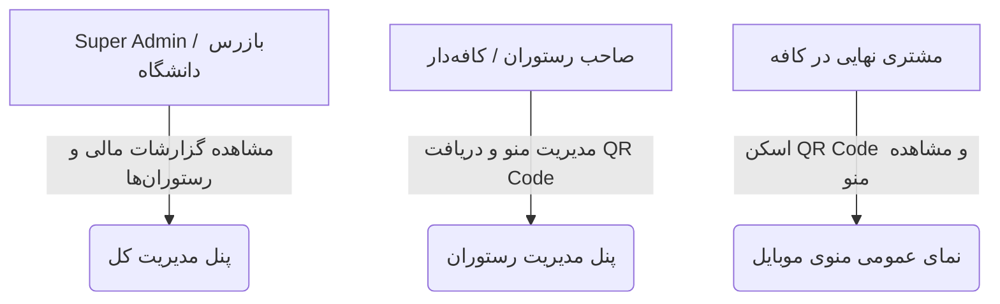

# سند جامع نیازمندی‌ها، معماری و استانداردهای پروژه (PROJECT_SPEC.md)

> این سند مرجع اصلی (Single Source of Truth) برای کل چرخه توسعه پروژه پلتفرم SaaS منوی دیجیتال و اشتراک رستوران است تا از پراکندگی کدها و دوباره‌کاری جلوگیری شود.

---

## ۱. اهداف و ماهیت پروژه (Project Overview)
* **نوع محصول:** پلتفرم SaaS چندمستاجره (Multi-Tenant B2B Platform) برای ساخت منوی دیجیتال هوشمند کافه‌ها و رستوران‌ها.
* **هدف دانشگاهی و تجاری:** برآورده ساختن الزام فروش دوره کارآفرینی/پروژه پایانی دانشگاه (هدف: ~۱۲ فروش اشتراک سالیانه به ارزش حدود ۱ میلیون تومان برای هر مشتری).
* **ارزیابی استاد:** امکان ورود استاد به عنوان بازرس (Inspector) برای مشاهده تعداد فروش واقعی، حجم گردش مالی، لیست رستوران‌های فعال و تاریخچه تراکنش‌ها با امکان خروجی رسمی (Excel/PDF).

---

## ۲. بازیگران سیستم و سطوح دسترسی (Actors & Roles)



1. **مدیر ارشد و استاد دانشگاه (SUPER_ADMIN / PROFESSOR_INSPECTOR):**
   * مشاهده شاخص‌های کلیدی عملکرد (KPIs): کل درآمد، تعداد اشتراک فعال، میانگین ارزش فروش.
   * لیست کامل تمام رستوران‌ها، وضعیت پرداخت و انقضای اشتراک آن‌ها.
   * دسترسی ویژه «حالت بازرس (Read-Only)» برای استاد جهت بررسی صحت فروش‌ها.
   * خروجی گزارش رسمی اکسل و چاپی جهت پیوست به دفاعیه دانشگاه.

2. **مدیر رستوران / مستأجر (RESTAURANT_ADMIN):**
   * احراز هویت و مدیریت پروفایل کافه (نام، لوگو، بایو، شماره تماس، آدرس، شبکه اجتماعی).
   * تعریف دسته‌بندی‌ها (نوشیدنی گرم، نوشیدنی سرد، فست‌فود، دسر و...).
   * مدیریت آیتم‌های منو (نام، قیمت، عکس، توضیحات، تاگل «موجود / ناموجود»).
   * تولید و دانلود QR Code اختصاصی برای چاپ روی میزها.
   * مشاهده وضعیت پلن اشتراک و تمدید آن.

3. **مشتری کافه (END_CUSTOMER):**
   * دسترسی بدون لاگین از طریق اسکن کیوآرکد روی میز (`/menu/[restaurant-slug]`).
   * رابط کاربری اپ‌مانند (App-like Mobile First) با لود فوق‌سریع.
   * فیلتر دسته‌بندی‌ها، جستجوی آنی در منو و مشاهده قیمت‌ها.

---

## ۳. پشته فنی (Technology Stack)

* **فریم‌ورک:** Next.js (App Router) + TypeScript + React
* **استایل‌دهی:** Tailwind CSS (طراحی مدرن، شیک، دارک/لایت مود و بهینه‌سازی شده برای موبایل)
* **پایگاه داده و ORM:** SQLite همراه با Prisma ORM (سبک، مستقل، بدون نیاز به نصب سرویس اضافه و آماده برای پرزنت حضوری و پروداکشن)
* **نمودارها و آیکون‌ها:** Recharts و Lucide React
* **تولید QR Code:** پکیج `qrcode.react` با قابلیت اضافه کردن لوگو در مرکز کیوآرکد
* **مدیریت نشست و احراز هویت:** Session-based / NextAuth سبک با کنترل دسترسی مبتنی بر نقش (RBAC)

---

## ۴. مدل داده‌ای و ساختار دیتابیس (Data Schema Blueprint)

### الف. جدول کاربران (User)
* `id`, `name`, `phone`, `email`, `passwordHash`, `role` (`SUPER_ADMIN`, `RESTAURANT_ADMIN`, `INSPECTOR`), `createdAt`

### ب. جدول رستوران‌ها (Restaurant / Tenant)
* `id`, `userId` (ارتباط با صاحب حساب), `slug` (شناسه یکتا در URL), `name`, `logoUrl`, `coverUrl`, `phone`, `address`, `instagram`, `wifiPassword`, `themeColor`, `createdAt`

### ج. جدول اشتراک‌ها و تراکنش‌ها (Subscription & Transaction)
* `id`, `restaurantId`, `planName` (مثلاً سالانه ۱ ساله), `amount` (مبلغ مثلا ۱,۰۰۰,۰۰۰ تومان), `status` (`ACTIVE`, `EXPIRED`, `PENDING`), `startDate`, `endDate`, `paymentMethod` (درگاه آنلاین / کارت‌به‌کارت تایید شده), `trackingCode`, `createdAt`

### د. جدول دسته‌بندی‌ها (Category)
* `id`, `restaurantId`, `title`, `orderIndex`, `icon`, `createdAt`

### ه. جدول آیتم‌های منو (MenuItem)
* `id`, `restaurantId`, `categoryId`, `title`, `description`, `price`, `imageUrl`, `isAvailable` (Boolean), `orderIndex`, `createdAt`

---

## ۵. استانداردهای کدنویسی و معماری پوشه‌ها (Folder Conventions)

```
Uni-Project/
├── prisma/                 # شمای دیتابیس و کدهای مایگریشن
│   └── schema.prisma
├── public/                 # فونت‌ها، تصاویر و آیکون‌های استاتیک
├── src/
│   ├── app/
│   │   ├── (auth)/         # صفحات ورود و ثبت‌نام
│   │   ├── admin/          # پنل سوپر ادمین و استاد دانشگاه
│   │   ├── dashboard/      # پنل مدیریت رستوران (صاحب کافه)
│   │   ├── menu/[slug]/    # صفحه نمایش منو برای مشتریان با اسکن QR
│   │   └── api/            # API Endpoints (محصولات، سفارشات، گزارشات)
│   ├── components/
│   │   ├── admin/          # کامپوننت‌های داشبورد سوپراادمین
│   │   ├── restaurant/     # کامپوننت‌های پنل رستوران
│   │   ├── menu/           # کامپوننت‌های منوی موبایل مشتری
│   │   └── ui/             # دکمه‌ها، کارت‌ها، جداول و مودال‌های مشترک
│   ├── lib/                # توابع کمکی، اتصال دیتابیس (Prisma)، فرمت‌کننده‌ها
│   └── types/              # تایپ‌های یکتای TypeScript
└── PROJECT_SPEC.md         # سند حاضر
```

---

## ۶. تصمیمات قطعی تایید شده (Confirmed Design Decisions)
* **روش‌های پرداخت اشتراک:** دوگانه (پشتیبانی از درگاه پرداخت شتابی شبیه‌سازی/واقعی + ثبت فیش و شماره پیگیری کارت‌به‌کارت با تایید ادمین).
* **عملکرد منوی مشتری:** منوی دیجیتال تعاملی فوق‌سریع موبایل با دسته‌بندی، فیلتر و جستجوی آنی (بدون درگیری‌های پیچیده ثبت سفارش و سبد خرید).
* **داده‌های اولیه (Seed Data):** راه‌اندازی دیتابیس با ۱۰ الی ۱۲ کافه/رستوران واقعی‌نما با لوگو، منو و تراکنش‌های ۱ میلیون تومانی جهت نمایش کامل به استاد در روز ارائه.

---

## ۷. چک‌لیست فازهای توسعه (Roadmap)
- [ ] فاز ۱: راه‌اندازی پروژه Next.js، کانفیگ Tailwind و ایجاد پایگاه داده Prisma
- [ ] فاز ۲: طراحی پنل سوپرادمین + داشبورد آمار فروش برای استاد دانشگاه
- [ ] فاز ۳: طراحی پنل صاحب رستوران (مدیریت دسته‌ها، آیتم‌های منو، اطلاعات کافه)
- [ ] فاز ۴: ماژول تولید و دانلود کیو‌آرکد اختصاصی
- [ ] فاز ۵: صفحه عمومی منوی کافه برای اسکن موبایل
- [ ] فاز ۶: تزریق داده‌های نمونه واقعی‌نما (Seed Data) جهت پرزنت درخشان به استاد

